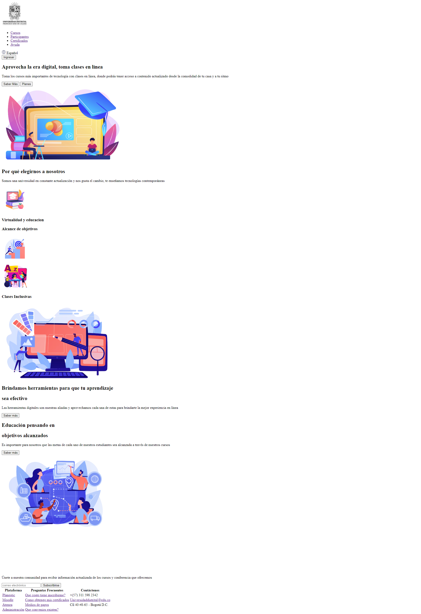
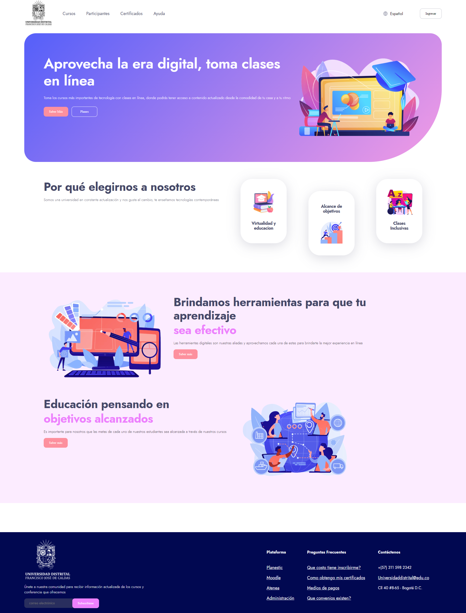
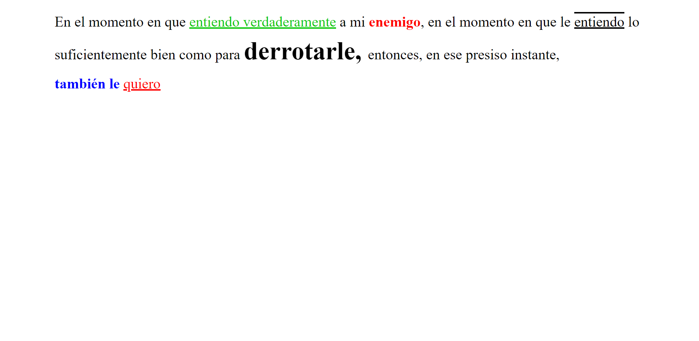

<h1>Taller 9: Jharol Acosta</h1>

<h2>Información</h2>

Curso: Full Stack Básico - Grupo 1
 

Profesor: Cristian Patiño

<h2>Punto 1: Link de figma</h2>
<a href="https://www.figma.com/file/g2n6ZlrG1twyTNBD5GCIR9/Untitled?node-id=3-80&t=Ne3Tz4jDanrnuMrs-0">Link de Figma</a>

 
<a href="https://ikanekl.github.io/Taller-9-Full-Stack/">Link Página</a>

<h2>Punto 2: HTML</h2>

<h2> Punto 3: CSS</h2>

<h2>Punto 4: Títulos</h2> 

<h2>Punto 5: Estilos de texto</h2> 

<h2>Punto 6: Enlaces</h2> 

<h2>Punto 7-8: Navegación</h2> 

<h2>Punto 9: Tablas</h2> 

<a href="https://github.com/IKaneKl/Taller-9-Full-Stack ">Link Repositorio</a>
